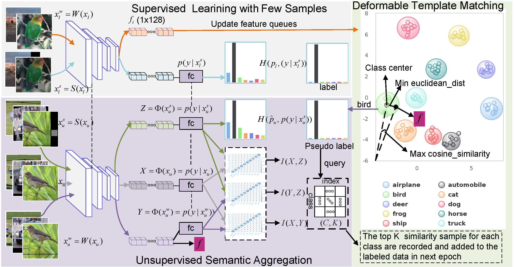
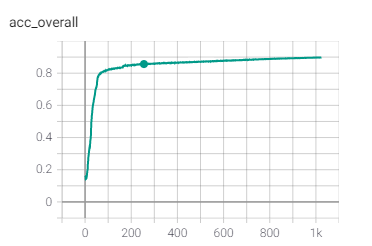

# USADTM

This repo is the official implementation of the paper of [USADTM](https://proceedings.neurips.cc/paper/2020/file/71a58e8cb75904f24cde464161c3e766-Paper.pdf):**Unsupervised Semantic Aggregation and Deformable
Template Matching for Semi-Supervised Learning**. The code is developed based on [C^3 Framework](https://github.com/gjy3035/C-3-Framework). 




# Quick Start


## Environment:
* GTX-1080ti gpu
* ubuntu-18.04
* Python 3.7.6

## Install 
* Clone this repo:
    ```git clone https://github.com/taohan10200/USADTM.git```
    
* Install other  dependencies:```pip install -r requirements.txt```

## Data preparation

- Manual way

    - You need to manually download the [CIFAR10](http://www.cs.toronto.edu/~kriz/cifar-10-python.tar.gz), [CIFAR100](http://www.cs.toronto.edu/~kriz/cifar-100-python.tar.gz), 
    - [STL10](http://ai.stanford.edu/~acoates/stl10/stl10_binary.tar.gz), [SVHN(train)](http://ufldl.stanford.edu/housenumbers/train_32x32.mat), [SVHN(test)](http://ufldl.stanford.edu/housenumbers/test_32x32.mat)

        The directory tree of dataset shold be like this:
        
        ```
        $USADTM/dataset
        ├── CIFAR10
        |    ├── cifar-10-batches-py
        |    └── cifar-10-python.tar.gz
        ├── CIFAR100
        |    ├── cifar-100-python
        |    └── cifar-100-python.tar.gz
        ├── STL10
        |    ├── stl10_binary.tar.gz
        |    └── stl10_binary
        ├── SVHN
        |    ├── train_32x32.mat
        |    └── test_32x32.mat
        ```
- Automatic way
    - Instead of creating the dataset by hand, the datasets and the tree will be downloaded and created automatically when excuting the command: ```python train.py```.


## Train the model

- To train the model, you should set the correct parameters in ```config.py```. In particular, the following parameters need to be confirmed:

    ```bash
    __C.dataset = 'CIFA10'  # 'CIFAR10' ,'CIFAR100', 'STL10', 'SVHN'
    __C.n_classes = 10
    __C.n_labeled = 250     # option: CIFAR10[40, 250,  4000]  CIFAR100[400,2500,10000] STL10, SVHN[40, 250,  1000]
    __C.batch_size = 64     # train batch size of labeled samples
    ```
    where `__C.n_labeled` is the number of labeled sample during training.

- Training with the command:
```bash
     $ python train.py
```

- Monitoring training progress with the command:
```bash
     $ tensorboard --logdir=exp --port=1111
```

## Results
After training, the metrics curves might be observed like this :

  
 
 

# Citation
If you find this project is useful for your research, please cite:
```
@article{han2020unsupervised,
  title={Unsupervised Semantic Aggregation and Deformable Template Matching for Semi-Supervised Learning},
  author={Han, Tao and Gao, Junyu and Yuan, Yuan and Wang, Qi},
  journal={Advances in Neural Information Processing Systems},
  volume={33},
  year={2020}
}